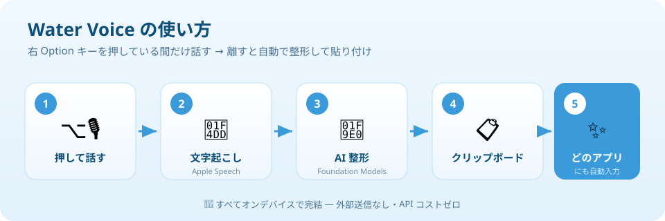
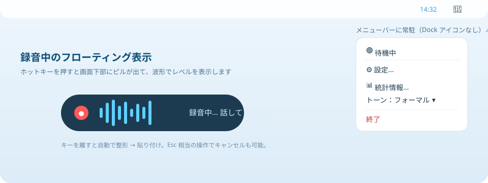
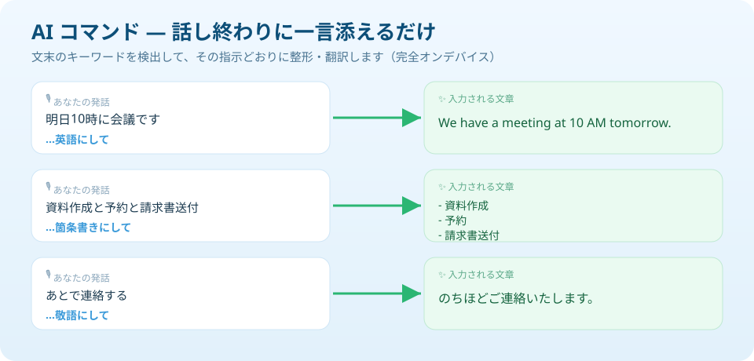
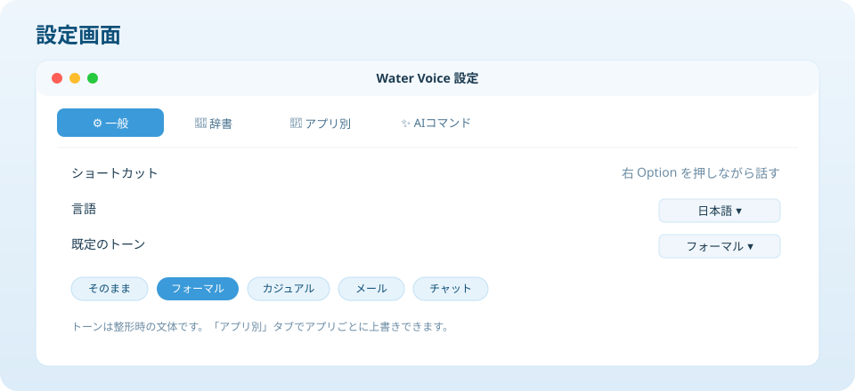
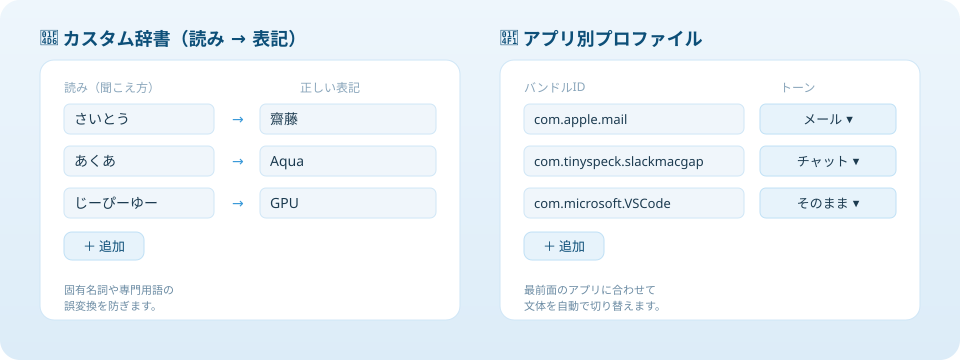

# Water Voice

**Water Voice** は、macOS 用のネイティブ常駐型 音声入力（ディクテーション）アプリです。
グローバルホットキーを押している間に話すだけで、**どのアプリにも** AI 整形済みのテキストを流し込めます。

Aqua Voice / Wispr Flow / Superwhisper といった有料アプリ相当の体験を、
**完全オンデバイス・API コストゼロ・プライバシー保持** で実現します。

<p align="center">
  
</p>

---

## 📖 使い方（図解）

### 1. 基本：押して話すだけ

1. 入力したいアプリ（メモ / Slack / ブラウザなど）でカーソルを置く
2. **右 Option キーを押している間** だけ話す
3. キーを離すと、AI が整形したテキストが **その場に貼り付けられます**

<p align="center">
  
</p>

### 2. AI コマンド：話し終わりに一言

文末に決まったキーワードを添えるだけで、翻訳・箇条書き・要約・敬語化ができます。

<p align="center">
  
</p>

| 言い方 | 効果 |
|---|---|
| 「…英語にして」「…英語に翻訳して」 | 英語に翻訳 |
| 「…日本語にして」 | 日本語に翻訳 |
| 「…箇条書きにして」 | 箇条書きに整理 |
| 「…要約して」 | 要点を要約 |
| 「…敬語にして」「…丁寧にして」 | 敬語に書き換え |

### 3. 設定：トーン・辞書・アプリ別プロファイル

メニューバーの 🍃 アイコン →「設定…」から開きます。

<p align="center">
  
</p>

固有名詞の辞書登録や、アプリごとの文体切り替えも数クリックで設定できます。

<p align="center">
  
</p>

#### アプリ別プロファイルのバンドルID早見表

「アプリ別」タブの **バンドルID** には、以下のような識別子を入力します。

| アプリ | バンドルID | おすすめトーン例 |
|---|---|---|
| メール（Mail） | `com.apple.mail` | メール |
| メモ（Notes） | `com.apple.Notes` | そのまま |
| メッセージ（Messages） | `com.apple.MobileSMS` | チャット |
| Safari | `com.apple.Safari` | そのまま |
| TextEdit | `com.apple.TextEdit` | そのまま |
| Slack | `com.tinyspeck.slackmacgap` | チャット |
| Google Chrome | `com.google.Chrome` | そのまま |
| VS Code | `com.microsoft.VSCode` | そのまま |
| Notion | `notion.id` | フォーマル |
| LINE | `jp.naver.line.mac` | カジュアル |
| Discord | `com.hnc.Discord` | チャット |
| Obsidian | `md.obsidian` | そのまま |

> 一覧に無いアプリのバンドルIDは、ターミナルで次のコマンドで調べられます（アプリ名を置き換える）:
>
> ```bash
> osascript -e 'id of app "アプリ名"'
> ```
>
> 例: `osascript -e 'id of app "Cursor"'`

> 💡 **図はイメージ（モックアップ）です。** 実機のスクリーンショットは、アプリ起動後に差し替え可能です。

---

## ✨ 特長

- 🎙 **押して話すだけ** — 右 Option キーを押している間だけ録音、離すと自動で整形・貼り付け
- 🧠 **AI 整形** — 句読点付け・フィラー（「えーと」「あのー」）除去・改行・誤認識修正
- 🌐 **完全オンデバイス** — Apple の Speech / Foundation Models のみを使用。外部送信なし・月額なし
- 📋 **どのアプリにも** — クリップボード経由 + Cmd+V 自動送信で、メモ / Slack / ブラウザ等に直接入力
- 🍃 **メニューバー常駐** — Dock アイコンなしで邪魔にならない

### 有料アプリ超えの追加機能（すべて無料・オンデバイス）

| 機能 | 使い方 |
|---|---|
| **AI コマンド** | 話し終わりに「**英語にして**」「**箇条書きにして**」「**要約して**」「**敬語にして**」と言うと、その通りに整形・翻訳 |
| **カスタム辞書** | 「読み → 表記」を登録（例: さいとう → 齋藤）して固有名詞・専門用語の誤変換を防止 |
| **アプリ別プロファイル** | 最前面のアプリに応じてトーンを自動切替（例: メールは敬語、Slack はチャット調） |
| **トーン切替** | フォーマル / カジュアル / メール / チャット / そのまま から文体を選択 |

---

## 🖥 動作環境

- macOS **26（Tahoe）以降**
- **Apple Silicon**（M1 以降）— Apple Foundation Models の実行に必須
- マイク

> 検証環境: MacBook Air M4 / 24GB RAM / macOS 26.5

---

## 🏗 アーキテクチャ

ロジックはテスト可能な Swift Package（`WaterVoiceCore`）に分離し、
プラットフォーム依存部（録音・文字起こし・整形・貼り付け）はアプリ側のアダプタで実装しています。

```
WaterVoiceCore (純粋ロジック / ユニットテスト対象)
├── AppCoordinator        パイプラインの状態機械（idle→recording→…→injecting）
├── DictationState        状態定義
├── Protocols             AudioRecording / Transcribing / Formatting / TextInjecting
├── FormatterPrompt       整形プロンプト生成（コンテキスト対応）
├── FormatterContext      トーン・辞書・コマンドを束ねる
├── DictationTone         トーン（フォーマル/カジュアル/メール/チャット）
├── DictionaryEntry       カスタム辞書（読み→表記）
├── VoiceCommand          AI コマンドとパーサー
├── ClipboardLogic        クリップボード退避→貼付→復元
└── SettingsStore         設定の永続化（言語/トーン/辞書/プロファイル）

WaterVoice (アプリ本体 / アダプタ)
├── AppDelegate                  全体の配線・ホットキー・ピル・統計
├── Adapters/
│   ├── AVAudioRecorder          AVAudioEngine による録音
│   ├── SpeechAnalyzerTranscriber Apple Speech（SpeechAnalyzer）で文字起こし
│   ├── FoundationModelsFormatter Apple Foundation Models で整形
│   ├── CGEventTextInjector      Cmd+V 送信
│   ├── HotKeyMonitor            グローバルホットキー監視
│   └── SettingsContextProvider  最前面アプリ + 設定 → FormatterContext
├── SettingsView / MenuBarView   設定・メニュー UI
└── FloatingPill / Waveform …    録音中のフローティング UI
```

### データフロー

```
ホットキー押下 → 録音開始（フローティングピル表示）
        離す → 録音停止
            → Apple Speech で文字起こし（生テキスト）
            → 末尾の AI コマンドを解析・除去
            → Foundation Models で整形（トーン・辞書・コマンドを反映）
            → クリップボードへ → Cmd+V 自動送信 → 元クリップボード復元
```

---

## 🚀 ビルド方法

### 前提ツール

- Xcode 26 以降
- [XcodeGen](https://github.com/yonomoto/XcodeGen)（`brew install xcodegen`）

### 手順

```bash
# 1. Xcode プロジェクトを生成
xcodegen generate

# 2. ビルド
xcodebuild -project WaterVoice.xcodeproj -scheme WaterVoice -configuration Debug build

# もしくは Xcode で WaterVoice.xcodeproj を開いて実行
```

### テスト

コアロジックのユニットテスト（Swift Testing + XCTest、計 30 件）:

```bash
cd WaterVoiceCore
swift test
```

---

## 🔐 必要な権限

初回起動時に以下の許可を求められます（システム設定 → プライバシーとセキュリティ）:

- **マイク** — 音声の録音
- **音声認識** — 文字起こし
- **アクセシビリティ** — Cmd+V の自動送信（他アプリへの貼り付け）

---

## 📁 リポジトリ構成

| パス | 内容 |
|---|---|
| `WaterVoice/` | アプリ本体（SwiftUI / アダプタ） |
| `WaterVoiceCore/` | テスト可能な純粋ロジック（Swift Package） |
| `docs/superpowers/specs/` | 設計書 |
| `docs/superpowers/plans/` | 実装計画 |
| `project.yml` | XcodeGen プロジェクト定義 |

---

## 🗺 ロードマップ

- [ ] 音声編集コマンド（「今のを消して」「改行」など）
- [ ] 文字起こし履歴の検索・再利用
- [ ] テキストスニペット展開（「マイメール」→ 実アドレス）
- [ ] ホットキーのカスタマイズ UI
- [ ] リアルタイム（ストリーミング）文字起こし表示

---

## 📝 ライセンス

個人プロジェクト。ライセンスは未定です。
